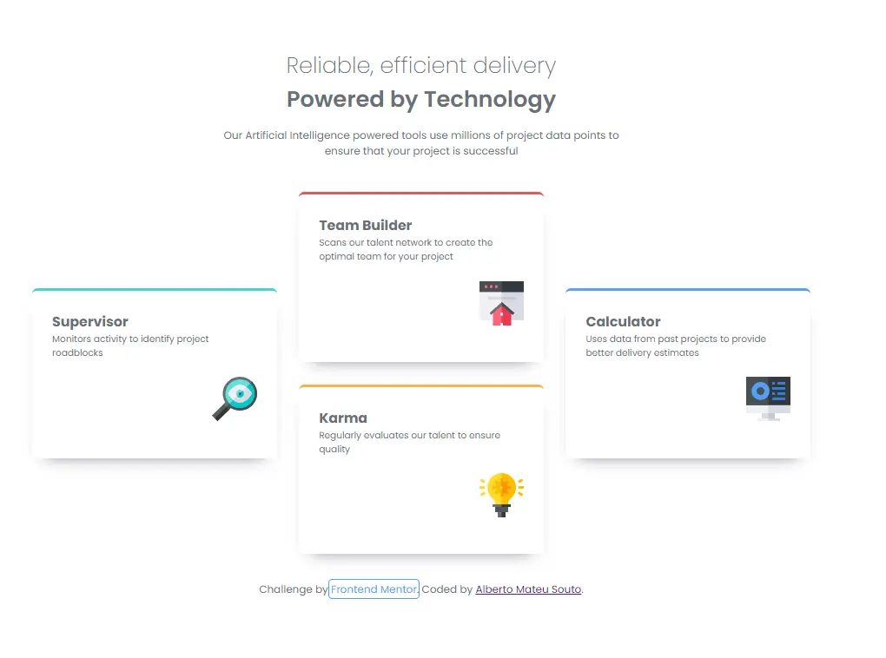

# Frontend Mentor - Four card feature section

Esta es mi solución al reto de **[Four card feature section](https://www.frontendmentor.io/challenges/four-card-feature-section-weTK1eGy)** de Frontend Mentor.

## Tabla de contenidos
- [El reto](#el-reto)
- [Captura de pantalla](#captura-de-pantalla)
- [Tecnologías utilizadas](#tecnologías-utilizadas)
- [Lo que aprendí](#lo-que-aprendí)
- [Autor](#autor)

## El reto
El objetivo era construir una sección de tarjetas de características (feature section) que se adaptara de forma fluida desde un diseño de una sola columna en móvil hasta una estructura compleja de rejilla (grid) escalonada en escritorio.

## Captura de pantalla

## Tecnologías utilizadas
- HTML5 semántico
- CSS Custom Properties (Variables)
- CSS Grid (Layout principal)
- Flexbox (Para detalles internos)
- Diseño responsivo (Mobile-first)
- Función `minmax()` para layouts fluidos

## Lo que aprendí
Durante este proyecto, enfrenté el desafío de maquetar una rejilla compleja de manera responsiva. Algunos de los puntos clave fueron:
- **CSS Grid:** Aprendí a controlar el posicionamiento específico de elementos usando `grid-column` y `grid-row`.
- **Diseño Fluido:** Implementé `minmax()` en lugar de anchos fijos para lograr una transición suave y sin desbordes entre los puntos de ruptura (breakpoints).
- **Mantenibilidad:** Refactoricé el código para que sea escalable, utilizando variables CSS y evitando duplicidad de reglas.

## Autor
- Frontend Mentor - [@tu-usuario](https://www.frontendmentor.io/profile/tu-usuario)
- GitHub - [tu-github](https://github.com/amateusouto)
